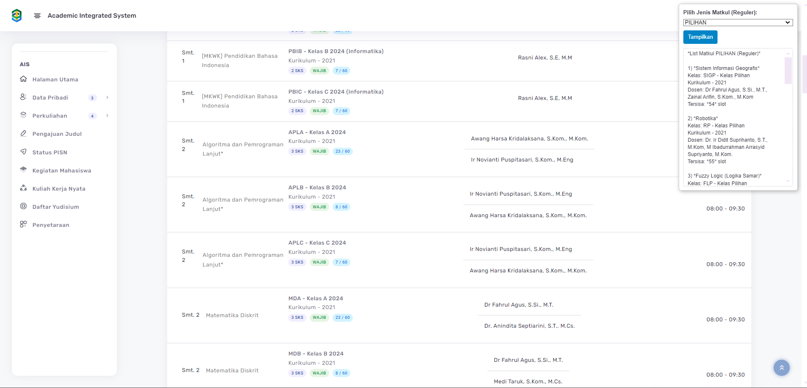

# 📚 Informasi Kuota Matkul Pilihan - AIS Unmul

Hey there! 👋 Mau tau cara gampang buat cek kuota matkul pilihan atau wajib di AIS Unmul? Yuk, ikutin langkah-langkah di bawah ini!

## 🚀 Cara Pakai Script

1. **Buka Halaman KRS**: Pastikan kamu sudah login ke AIS Unmul dan berada di halaman KRS.

2. **Tambahkan Script**: Copy script di bawah ini dan paste di console browser kamu (tekan `F12` atau `Ctrl+Shift+I` untuk buka console).

    ```javascript
    (function() {
    const menuHTML = `
      <div id="menu-slot" style="
        position: fixed;
        top: 10px;
        right: 10px;
        z-index: 999999;
        background: #ffffff;
        border: 1px solid #ccc;
        padding: 10px;
        width: 300px;
        font-family: Arial, sans-serif;
        box-shadow: 2px 2px 10px rgba(0,0,0,0.3);
        border-radius: 6px;
      ">
        <label for="tipeMatkul" style="margin-bottom: 5px; font-weight: bold; display: block;">
          Pilih Jenis Matkul (Reguler):
        </label>
        <select id="tipeMatkul" style="width: 100%; margin-bottom: 10px;">
          <option value="">-- Pilih --</option>
          <option value="WAJIB">WAJIB</option>
          <option value="PILIHAN">PILIHAN</option>
        </select>
        <button id="btnTampilkan" style="
          background: #0284c7;
          color: #fff;
          border: none;
          padding: 7px 12px;
          cursor: pointer;
          border-radius: 4px;
        ">
          Tampilkan
        </button>
        <div id="hasilSlot" style="
          margin-top: 10px;
          max-height: 350px;
          overflow-y: auto;
          font-size: 13px;
          line-height: 1.4;
          border: 1px dashed #ccc;
          padding: 5px 10px;
          border-radius: 4px;
          white-space: pre-wrap; /* Supaya \n terbaca sebagai line-break */
        "></div>
      </div>
    `;
    document.body.insertAdjacentHTML('beforeend', menuHTML);
  
    const containerReguler = document.querySelector('#reguler #paginated-list');
    if (!containerReguler) {
      console.log('Tidak menemukan #reguler #paginated-list. Pastikan tab "Reguler" ada.');
      return;
    }
  
    const allInboxData = containerReguler.querySelectorAll('li.inbox-data');
  
    function getSisaSlot(str) {
      // Contoh "19 / 60" → 60 - 19 = 41
      const [terisiStr, kapasitasStr] = str.split('/');
      const terisi = parseInt(terisiStr, 10);
      const kapasitas = parseInt(kapasitasStr, 10);
      return kapasitas - terisi;
    }
  
    function tampilkanMatkul(kriteria) {
      let outputText = '';
      let nomor = 0;
  
      allInboxData.forEach(li => {
        const namaMatkul = li.querySelector('.inbox-user p')?.textContent?.trim() || '(Tanpa Nama)';
          const badgeEls = li.querySelectorAll('.badge');
        let isKriteria = false;
        let sisaSlot = null;
  
        badgeEls.forEach(b => {
          const txt = b.textContent.trim().toUpperCase();
          if (txt === kriteria.toUpperCase()) {
            isKriteria = true;
          }
          if (/^\d+\s*\/\s*\d+$/.test(txt)) {
            sisaSlot = getSisaSlot(txt);
          }
        });
  
        if (isKriteria && sisaSlot !== null) {
          let detailStr = li.querySelector('.email-data span')?.textContent?.trim() || '';
            detailStr = detailStr.replace(/(Kurikulum\s*-\s*\d+)/, '\n$1');
  
        
          const dosenEls = li.querySelectorAll('.email-dosen ul li');
          const dosenList = Array.from(dosenEls).map(d => d.textContent.trim()).join(', ');
  
          nomor++;
          outputText += `${nomor}) *${namaMatkul}*\n` +
            `Kelas: ${detailStr}\n` +
            `Dosen: ${dosenList}\n` +
            `Tersisa: *${sisaSlot}* slot\n\n`;
        }
      });
  
      if (!outputText) {
        outputText = `Tidak ada matkul "${kriteria}" di tab Reguler (atau slot tidak terdeteksi).`;
      } else {
        outputText = `*List Matkul ${kriteria} (Reguler)*\n\n` + outputText;
      }
  
      document.getElementById('hasilSlot').textContent = outputText;
    }
  
    document.getElementById('btnTampilkan').addEventListener('click', () => {
      const tipe = document.getElementById('tipeMatkul').value;
      if (!tipe) {
        alert('Pilih "WAJIB" atau "PILIHAN" dulu!');
        return;
      }
      tampilkanMatkul(tipe);
    });
  
    console.log(
      '%cMenu filter matkul Reguler telah dibuat.\nPilih "WAJIB" atau "PILIHAN" → klik "Tampilkan".\nHasil akan muncul di kotak "Hasil".',
      'color: green; font-weight: bold;'
    );
  })();
    ```

3. **Pilih Jenis Matkul**: Setelah script dijalankan, akan muncul menu di pojok kanan atas. Pilih jenis matkul yang kamu mau cek (WAJIB atau PILIHAN).

4. **Klik Tampilkan**: Tekan tombol "Tampilkan" dan lihat hasilnya di kotak "Hasil".

## 📸 Preview
1. Tampilan ketika kamu menggunakan script.


## 📤 Kirim ke WhatsApp

Hasil yang muncul bisa langsung kamu copy dan kirim ke WhatsApp teman-temanmu. Gampang banget, kan?


## 📝 Catatan

- Pastikan kamu berada di tab "Reguler" di halaman KRS.
- Matkul yang belum diambil akan ditampilkan dengan sisa slot yang tersedia.

Selamat mencoba dan semoga bermanfaat! 🎉
