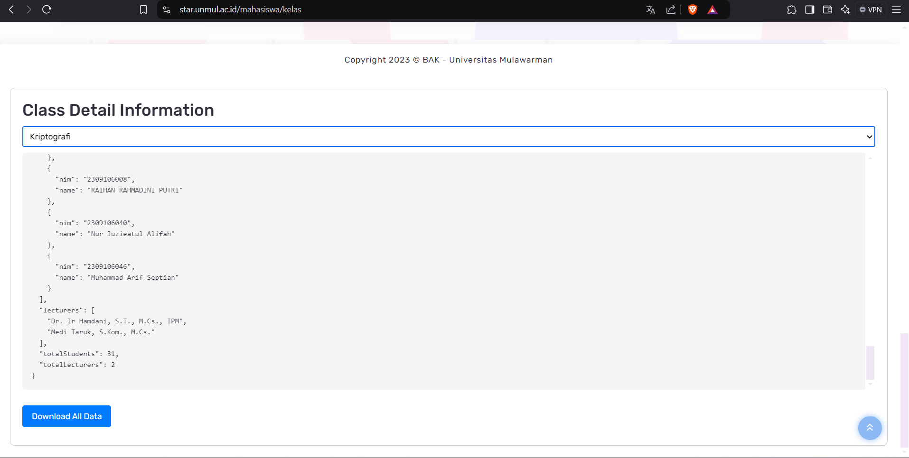

# STAR Gathering Info ✨

## Halo! 👋

Selamat datang di alat **STAR Gathering Info**! Ini adalah skrip andalanmu untuk mengambil detail kelas dari [STAR Unmul](https://star.unmul.ac.id/). Tapi pertama-tama, kamu harus login dulu untuk mengakses keajaibannya! ✨

## Cara Penggunaan

1. **Login ke STAR Unmul**: Buka [STAR Unmul](https://star.unmul.ac.id/mahasiswa/kelas) dan login.
2. **Buka Dev Console**: Tekan `F12` atau `Ctrl+Shift+I` untuk membuka Developer Console.
3. **Copy & Paste Skrip**: Salin seluruh skrip dari `star.js` dan tempelkan ke dalam console.
4. **Jalankan Skrip**: Tekan `Enter` dan saksikan keajaibannya!

## Fitur

- **Ambil Detail Kelas**: Secara otomatis mengambil dan menampilkan detail kelas.
- **Unduh Data**: Unduh semua data yang diambil dalam bentuk file JSON.
- **UI Interaktif**: Pilih kelas yang berbeda untuk melihat detailnya.

## Screenshot

## Nikmati! 😎

Jangan ragu untuk menghubungi jika kamu punya pertanyaan atau mengalami masalah. Selamat coding! 🚀
